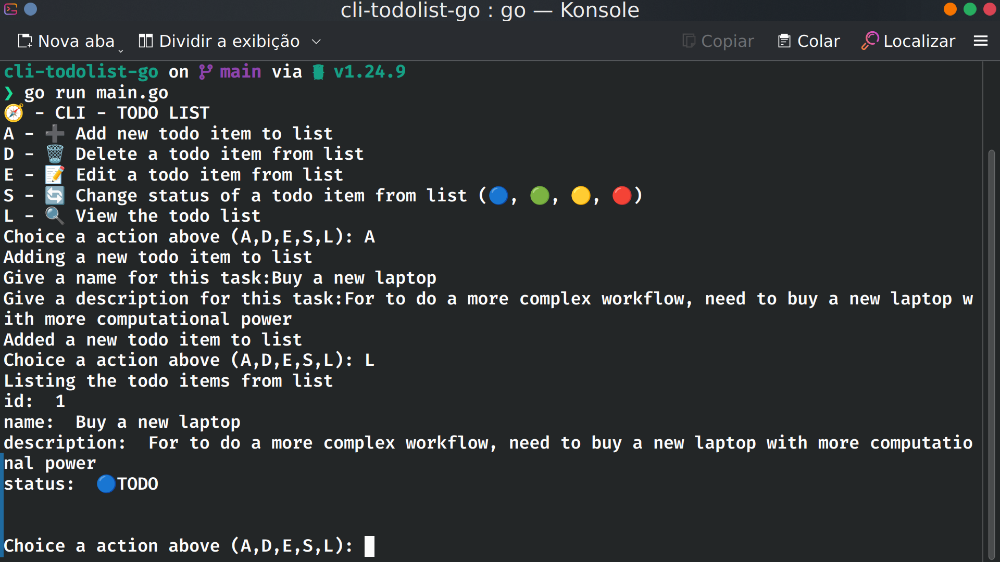

## CLI Lista de tarefas em Go

Aplicação CLI classica para lista de tarefas, tendo como objetivo exercitar os conceitos de forma prática da linguagem GO

### Conceitos 
- Variaveis e tipos
- Fluxo de controle
- Fluxo de repetição
- Ponteiros 
- Structs, Receptores e Composição
- Map, String
- Metodos
- Erros e Nil

